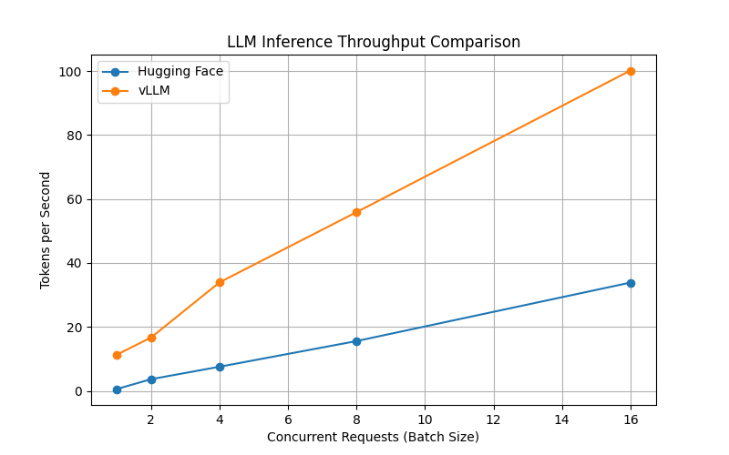

# vllm-throughput-benchmark
Benchmarked LLM inference throughput using vLLM vs Hugging Face generation, focusing on batching, KV cache behavior, and scalability under concurrent requests.
# High-Throughput LLM Inference Benchmarking with vLLM

This project benchmarks LLM inference throughput using vLLM and compares it against Hugging Face generation under concurrent load.

The goal is to understand how dynamic batching and KV cache management impact throughput, latency, and GPU utilization in real-world LLM serving scenarios.

## Environment

- Platform: Google Colab (free tier)
- GPU: NVIDIA T4 or L4
- Frameworks: vLLM, Hugging Face Transformers
- Model (initial): TinyLlama 1.1B Chat

## Current Status

- vLLM environment setup and sanity check completed
- Deterministic generation configured for benchmarking

## Results

This benchmark compares Hugging Face `generate()` with vLLM under increasing concurrent request load on a single GPU.

### Throughput Comparison

| Batch size | HF tokens/sec | vLLM tokens/sec | Speedup |
|-----------|---------------|-----------------|---------|
| 1 | 0.61 | 11.34 | 18.6× |
| 2 | 3.68 | 16.71 | 4.5× |
| 4 | 7.58 | 33.95 | 4.4× |
| 8 | 15.59 | 55.89 | 3.6× |
| 16 | 33.87 | 100.15 | 3.0× |

### Analysis

Hugging Face generation shows limited throughput scaling due to static batching and sequential request handling.  
vLLM scales more effectively under concurrent load by dynamically batching token generation and efficiently managing the KV cache.

The largest gains appear at moderate to high concurrency, which better reflects real-world LLM serving scenarios.

## How to Run

Open `vllm_throughput_benchmark.ipynb` in Google Colab, enable GPU runtime, and run all cells from top to bottom.

## Motivation

Most LLM performance issues in production come from inference pipelines rather than model quality. This project focuses on understanding and measuring inference behavior under realistic serving conditions.
